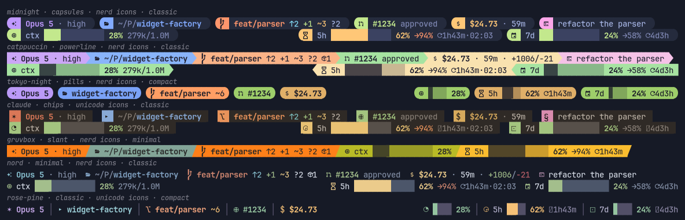
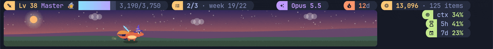

# claude-statusline

A fast, good-looking status line for [Claude Code](https://claude.com/claude-code),
with an interactive configurator and **Claude Quest**, an RPG that plays itself
while you work.



- **Looks**: 19 themes, 8 styles (from plain text to powerline and rounded
  capsules), Nerd Font, Unicode or emoji icons, 8 bar styles with sub-cell
  precision and gradient fills. Truecolor, 256 or 16 colours.
- **Configure it live**: `statusline.py configure` opens a full-screen editor
  with a live preview of your bar; every change shows before you save it.
- **Always fits**: every line is measured exactly the way Claude Code measures
  it, gives up detail gracefully when the terminal is narrow, and never clips.
- **Fast**: about 10 ms a refresh, 4 of them Python starting up. Git runs in
  the background, so the bar never waits for it.
- **Live activity**: the tools Claude is running, the subagents at work,
  how long the turn has run, and the permission mode, from background hooks.
- **Your own data**: command segments that run your scripts in the
  background, today's spend across sessions, a prompt-cache countdown.
- **Claude Quest**: XP for every tool Claude uses, loot as replies land,
  bosses summoned by failing tests, daily quests, a shop, and a pet that
  lives in the corner of your bar. In game mode the whole bar is the game,
  with your session details on its top row. One switch turns it on or off.



Pure Python 3.11+, standard library only (the kitty pet picture uses pycairo).

## Install

```sh
git clone https://github.com/astrosteveo/claude-statusline ~/Projects/claude-statusline
cd ~/Projects/claude-statusline
./install.sh            # add --quest to switch Claude Quest on too
```

That writes a small shim to `~/.claude/statusline.py`, creates
`~/.config/claude-statusline/config.toml` with a look your terminal can draw,
and points `statusLine` in `~/.claude/settings.json` at it, backing up
anything it replaces. The bar appears on Claude Code's next refresh.
`./install.sh --uninstall` puts your previous status line back.

To see it before you install anything, `python3 statusline.py demo` plays a
scripted session in your terminal: the looks, a narrowing window, game mode,
the party and live activity.

As a plugin, the `design` skill lets Claude restyle the bar for you:

```
/plugin marketplace add astrosteveo/claude-statusline
/plugin install claude-statusline@claude-statusline
/claude-statusline:design one line, powerline, catppuccin
```

## Make it yours

```sh
python3 ~/.claude/statusline.py configure      # or `claude-statusline configure`, or no arguments in a terminal
```

The configurator shows your bar at the top, drawn with a sample (or the last
real payload it received), and changes it as you move:

| page | what you change |
|------|-----------------|
| Look | theme, style and icons; the configurator itself wears the theme you are on |
| Layout | presets, and every line: add, remove, reorder segments, move them between lines and sides |
| Segments | each segment's options, format, icon, colour and priority |
| Bars | bar style, width, fill and track, with sample bars |
| Quest | Claude Quest on or off, where its line goes, the pet picture |
| More | colour depth, margins, thresholds, git, the heartbeat tick, clock, directory style |

`s` saves (with a backup of your old file); the bar picks it up within a
second. From a shell, or for scripts:

```sh
statusline.py set theme catppuccin
statusline.py set style powerline
statusline.py set segment.dir.mode base
statusline.py themes          # every theme drawn with your own layout (also: styles, icons, bars)
statusline.py preview --width 80,120,160
```

## The config

`~/.config/claude-statusline/config.toml`. Every key is optional:

```toml
theme = "midnight"      # colours
style = "capsules"      # minimal, classic, dots, chips, capsules, pills, powerline, slant
icons = "nerd"          # nerd, unicode, emoji, none
preset = "classic"      # classic, compact, dashboard, focus, minimal, dev, arcade

[[line]]                # your own lines replace the preset's
left = ["model", "dir", "git", "pr", "cost"]

[[line]]
left = ["context"]
right = ["limit_5h", "limit_7d"]

[segment.dir]
mode = "base"

[bar]
style = "slim"
fill = "gradient"
```

**Styles.** `minimal`, `classic` and `dots` are coloured text. `chips` sets
each segment on a soft surface with a coloured icon block and works in any
font; `capsules` is the same with rounded ends, `pills` makes each segment a
rounded pill of its own colour, and `powerline` and `slant` join coloured
segments with arrows or slants. Those four need a Nerd Font, or a terminal
that bundles the symbols: kitty, WezTerm and Ghostty do, so `auto` picks
capsules there and chips elsewhere.

**Themes.** claude, claude-light, midnight, catppuccin, catppuccin-latte,
tokyo-night, nord, dracula, gruvbox, rose-pine, kanagawa, everforest,
one-dark, solarized-dark, solarized-light, synthwave, mono, `terminal` (your
terminal's own 16 colours) and `classic` (the 2.x palette). Override any
colour in `[colors]`.

**Segments.**

| segment | shows |
|---------|-------|
| `model` | model, effort, fast mode |
| `dir` | working directory, abbreviated (fish, compact, full, base or project-relative) |
| `git` | branch, ahead/behind, staged/modified/untracked, conflicts, stashes, rebase/merge state, a nudge when a dirty tree goes stale |
| `pr`, `worktree` | the pull request and its review state; the worktree |
| `context` | context window: bar, percentage, tokens |
| `limit_5h`, `limit_7d`, `limit_7d_model`, `limit_spend` | rate-limit windows with a pace projection (`→94%`: where you will be at the reset) and the reset countdown |
| `cost`, `duration`, `diff`, `burn`, `tokens` | spend, wall time, lines changed, $/hour, tokens in and out |
| `spend` | what today cost across every session, the month so far, and an optional daily budget as a bar |
| `cache` | the prompt cache: while it is costing you (with the likely cause of the last miss), and counting down the last minutes before a warm cache goes cold |
| `env`, `host`, `session`, `agent`, `vim`, `output_style`, `version`, `clock` | the rest of what the host knows |
| `text` | your own label; place several with `type = "text"` |
| `command` | the first line of your own command's output, run in the background (below) |
| `turn`, `tools`, `agents`, `tasks`, `mode` | live activity: what Claude is doing now (below) |
| `heartbeat` | a tick that moves while the bar refreshes (off unless placed: a debugging aid) |
| `quest`, `quest_boss`, `quest_raid`, `quest_dungeon`, `quest_daily`, `quest_buffs`, `quest_event`, `quest_streak`, `quest_gold`, `quest_pet` | Claude Quest |

`statusline.py segments <name>` lists a segment's options, fields and colours;
[catalog.md](skills/design/reference/catalog.md) has all of them, and
[schema.md](skills/design/reference/schema.md) the format language
(`{field}`, `[optional]`, `<colour>`, `<bold>`, `<link>`).

**How a line fits.** When a line is too wide, every segment on it gives up
detail together (the reset clock, then the pace and token counts, then bars
at half width, then no bars) and only then does the lowest-priority segment
drop. Give what you care about a higher `priority`.

## Your own commands

```toml
[[line]]
left = ["model", "dir", "git", "oncall"]

[segment.oncall]
type = "command"
command = "oncall-now --short"     # anything that prints a line; colours are kept
every = 60                          # seconds between runs
timeout = 2                         # killed after this long
```

A command segment shows the first line its command printed. The bar never
runs the command itself or waits for it: a detached runner does, at most
every `every` seconds (at least 2) and for at most `timeout` seconds (at most
10), and the bar reads its last output from a cache. The command runs with
`/bin/sh` in the session's directory, with `STATUSLINE_CWD`,
`STATUSLINE_PROJECT_DIR`, `STATUSLINE_MODEL` and `STATUSLINE_SESSION_ID` set;
`per = "global"` shares one output across directories. `[commands] enabled =
false` (or `CLAUDE_STATUSLINE_NO_COMMANDS=1`) turns them all off, and
`doctor` shows each one's last run.

## Spend today

The `spend` segment adds up what every session cost today, as this bar saw
it, in your local day: `today $61.20 · month $489`. Set `budget` for a daily
limit drawn as a bar that turns yellow, orange and red as it fills, and
`week = true` for the last seven days. The ledger lives in
`~/.local/state/claude-statusline/spend.bin`; it counts only sessions this
status line drew (not `claude -p`, not other machines). The `dashboard`
preset shows it; elsewhere add it on the configurator's Layout page.

## Live activity

```sh
statusline.py activity enable      # background hooks; the segments get a line of their own
statusline.py activity disable
```

The bar shows what Claude is doing right now:

| segment | shows |
|---------|-------|
| `turn` | `working 2m14s` while Claude answers, `waiting 4m` once it has, `compacting`, or why a turn stopped |
| `tools` | the tool running (the longest-running, if several), what it works on and for how long, then this turn's finished ones: `Bash pytest -q 18s ✓ Edit ×2 · ✓ Read ×2` |
| `agents` | the subagents at work: kind, task and time |
| `tasks` | the task list, where the model keeps one: the task in hand and how many are done |
| `mode` | the permission mode when it is not the default: plan, accept edits, auto, don't ask, bypass |

The hooks run in the background (`async`), so no tool call waits for them,
and each event updates a small file per session that a refresh reads once.
Nothing reads the transcript. The segments get a line of their own under
yours (in game mode they join the top row's details) unless you place any of
them yourself; `[activity] placement = "manual"` turns that off.

## Git panels

```sh
statusline.py use dev              # the dev preset: the session on one line, the panels under it
```

A block of rows under your lines shows the repository side by side, so you
rarely need `git status`, `git log --graph` or `git branch -vv` in another
window:

| panel | shows |
|-------|-------|
| `files` | the changed files, conflicts first, with lines added and removed, and a rebase, merge, cherry-pick or bisect in progress with its step |
| `graph` | the commit graph of your branches: hash, branches and tags, subject, age |
| `branches` | your branches, newest first: how far each is ahead of or behind its upstream, `local` with none, `gone` when the upstream was deleted, `merged` once the default branch has it |
| `stash` | the stashes; shown only while there is one |

```toml
[panels]
show = ["files", "graph", "branches", "stash"]   # left to right; empty turns them off
rows = 6              # 1 to 16; the block keeps this height whatever git holds
cache_ttl = 3.0       # seconds a refresh stays fresh; a commit, fetch or stash shows at once
commits = 40          # commits read for the graph
```

A background process reads git, as for the `git` segment, so the bar never
waits; the first refresh in a repository says `Reading git…`. The columns
follow the terminal's width, and a panel that no longer fits drops, the last
named first. Each file is a `file://` link, and each commit links to the
web when Claude Code knows the repository (Ctrl+Shift+click in kitty). The
panels are hidden in game mode, which takes the whole bar.

## Click to cycle

```sh
statusline.py clicks enable      # once; Linux, with xdg-open
```

A cycle is a slot on a line that shows one segment and moves to the next
when you ctrl+shift+click it in kitty, so one slot's room holds several:

```toml
[[line]]
left = ["model", "dir", "git"]
right = ["usage", "limits"]

[segment.usage]
type = "cycle"
of = ["context", "tokens", "cost"]   # context until you click, then tokens, then cost

[segment.limits]
type = "cycle"
of = ["limit_5h", "limit_7d"]
```

The `dev` preset places these two. Each member keeps its own options. Where
it has a link of its own (a branch, a pull request), that part opens the link
and the rest of it cycles. A git panel too long for its rows ends in
`page 1/3 ›`: click it for the next page. Clicks change only what this
session shows, never your config, and show on the next refresh. Without
`clicks enable` a cycle shows its first segment and a long panel ends in
`+7 more`.

## Claude Quest

```sh
statusline.py quest enable      # hooks, the /quest command, the quest line
statusline.py quest disable     # all of it off again; your save is kept
```

Every tool Claude uses earns XP (your class is the school of tools you use
most), commits and pushes pay gold, loot drops as replies land, and a failing
test, build or lint run summons a boss with one HP per failure; fix it to win.
Three daily quests and a weekly one, a shop that restocks every day, a forge,
gear in five slots with set bonuses and titles, streaks, achievements, and a
pet that evolves at levels 5, 15, 30 and 50. At 30 it takes the form of the
school you use most (ember, forge, lore, arcane or storm), with a bonus
to match; a wyrm doubles it.

Each subagent Claude sends out joins your party: in game mode it walks with
your pet while it works, and it brings back XP with its report. When a long
conversation is compacted, your pet tidies the scrolls. (After upgrading from
3.x, run `statusline.py quest enable` once more to register the hooks these
need.)

From 24 October to 1 November the Hallowed Harvest is on: bosses are
haunted, seasonal gear and candy drop (the set makes you the Haunted), one
daily quest is Trick or Treat, and the scene has pumpkins and bats. Any day,
a treasure goblin may scurry past; commit within ten minutes to catch it
and its sack. `[quest] seasons = false` turns the seasons off.

A pull request opened with `gh pr create` is a dungeon: every push is a room,
failing `gh pr checks` spring traps, and `gh pr merge` clears it, paying more
the deeper it went. Each week your first commit in a project summons a
tech-debt raid boss with one HP per TODO, FIXME, XXX or HACK; commits that
remove them strike it.

On the bar: your level, title and XP; today's quests; the boss's hearts; this
project's raid boss and dungeon; live buffs; news of the latest loot or
level-up; your streak and gold; and the pet.
In kitty the pet is an animated picture at the right edge, wearing your gear,
running while tools fire, fighting bosses, celebrating loot and dozing when
you step away; elsewhere it is a little text sprite.

### Game mode

The `arcade` preset is the whole game, set up for you: eight rows of scene,
the news beside it, eight gauges (context, the 5-hour and 7-day limits, cost,
burn rate, tokens, the prompt cache, lines changed) and your session on the
top row. `statusline.py use arcade` switches to it, or pick Layout in the
game's menu. It keeps your theme, style and icons, takes out the keys of
yours it sets (and your own `[[line]]` tables), and backs up your config
first. A preset may carry `[quest]`, `[bar]`, `[activity]`, `[layout]`,
`[thresholds]` and `[panels]` settings; anything you set yourself afterwards wins.

```toml
[quest]
enabled = true
placement = "game"
```

The whole bar becomes the game. Below the top line a scene spans the width:
your pet wanders, runs while tools fire, charges the boss or the tech-debt
kraken, throws confetti at loot, waits for you after a reply and sleeps when
you step away, with a castle on the hill while a PR dungeon is open. In kitty
it is an animated picture (drawn once per situation and looped by kitty
itself, so it moves smoothly between refreshes); elsewhere it is a little
text world. `game_rows` sets the height.

The top line is the quest ticker, with your session details beside it: the
model first, then the segments of your own lines (or your preset's), less
what the gauges show. The ticker is fitted first and never changes for
them, and the news takes any room left before they do. The details give way
one at a time, lowest priority first: less detail, then just the icon, then
gone. `game_details` sets the list yourself (`[]` for none); the
configurator's Layout page edits it.

What the game says (loot, level-ups, quests, bosses) goes to a news column
beside the scene, newest first, and nothing is printed into the conversation.
`game_news` sets its width (`"auto"`: on terminals 120 columns or wider, with
three or more rows of scene; `"off"`; or columns). With the game on a line of
its own or inline, there is no room for it, so the messages still go to the
conversation. `notify = false` turns off the desktop pop-ups and sounds.

Beside each row of scene sits one gauge from `game_hud` (context, 5h and 7d
by default; any segment works). On a wide terminal the gauges also show a
bar, the pace and the reset time.

#### Settings from the game

```sh
statusline.py clicks enable      # once; Linux, with xdg-open
```

Game mode's top row then ends in a gear. Ctrl+shift+click it in kitty and a
menu takes the scene's place, with a tab for each part of the game:

- **Quests**: today's and this week's, with a reroll button while today's free
  reroll lasts.
- **Bag**: use, wear or sell (spare copies only), sell every spare, forge. The
  last two ask before they act.
- **Shop**: today's stock, with a buy button for what you can afford.
- **Hero**: your level, pet, gear, bosses, dungeons and raids; click a title
  to wear it.
- **Settings**: the theme, style, icons and bar style, the rows of scene, the
  picture, the news, the party, the seasons and pop-ups. Click ‹ or › to step
  through a setting, or the value itself to see every choice at once.

What a click did shows on the menu's top row, and each change shows on the
next refresh, a second later. The menu opens only in the session you
clicked, and closes itself after five minutes without a click.

Claude Code sends the status line no clicks, so the buttons are links, and
`clicks enable` makes `statusline.py click` the opener of
`claude-statusline://` links. Plain ctrl+click belongs to Claude Code, which
opens only web links; ctrl+shift+click is kitty's own. A link only ever picks
from the menu's choices, whoever printed it. `clicks disable` undoes it.

Inside Claude Code, `/quest` takes a game command (`/quest bag`) or a request
in your own words (`/quest what should I buy?`, `/quest equip my best gear`):
Claude answers those with the `claude-quest` skill, which `quest enable`
installs and which also wakes up whenever you ask about the game in chat.
`quest enable` also registers the game's tools with Claude Code (the
`claude-quest` MCP server: `quest_status`, `quest_bag`, `quest_shop`,
`quest_best_gear`, `quest_act`), so Claude reads your hero as data and acts
in a single call each.
`claude-quest best` scores every combination of the gear you own on your own
history (your tool calls, commits, pushes and test runs, with set bonuses)
and `best equip` wears the winner.

Play with `/quest` inside Claude Code or `claude-quest` in a terminal: `sheet`,
`bag`, `best`, `equip`, `use`, `sell`, `forge`, `shop`, `buy`, `quests`, `boss`, `dungeons`, `raid`, `pet`,
`titles`, `achievements`, `log`, `guide`.

## Performance

The bar runs once a second in every session, so it is built to be cheap:

- the payload is parsed with the C JSON scanner directly (importing `json`
  and `re` would cost more than drawing the whole bar);
- the config is compiled once and cached; a refresh is a stat and a read;
- segment modules load only when placed;
- git runs in a detached background process that refreshes a cache, so a
  slow repository slows nothing; the branch comes straight from `HEAD`.
- Claude Quest's hooks run in the background except at the start of a
  session and the end of a turn, so no tool call waits for the game; the
  save is written with the fast C encoder;
- a settings menu left open closes from its file's age, before anything is
  read.

`statusline.py bench` measures it on your machine.

## Troubleshooting

```sh
statusline.py doctor      # what is installed, detected and in force
statusline.py validate    # every problem in the config, with suggestions
statusline.py preview     # the bar at several widths, with notes on what gave way
```

**Boxes instead of icons.** Your font lacks Nerd Font symbols:
`statusline.py set icons unicode` and `set style chips`.

**A line ends in `…` or the right side stops short.** Claude Code keeps a few
columns at the right edge. Run `statusline.py ruler` as the status line
command, read the last digit visible on the second row, and add it to
`layout.right_margin`. A glyph your font draws double-width does the same;
list it in `layout.wide_glyphs`.

**It only shows the model and directory.** That is the fallback: something
raised. `CLAUDE_STATUSLINE_DEBUG=1 statusline.py render --sample busy` prints
the traceback.

**Clicking the gear does nothing.** Use ctrl+shift+click: plain ctrl+click
is Claude Code's, and it ignores `claude-statusline://` links. `statusline.py
clicks status` shows what the links run; run `clicks enable` again after
moving the checkout. `clicks.log` in the runtime folder (`doctor` shows it)
records every click and what it did. If the log stays empty, Claude Code may
not have detected link support in your terminal: start it with
`FORCE_HYPERLINK=1 claude`.

**Upgrading from 3.x.** Configs and saves carry over unchanged. Run
`statusline.py quest enable` once more if Quest is on, so its hooks include
the subagent and compaction events; `doctor` says when they are out of date.
Game mode now puts your session details on its top row (`[quest]
game_details = []` turns that off).

**Upgrading from 2.x.** 2.x configs still render. `statusline.py migrate --write`
tidies one (hand-placed avatar rows become automatic placement, bar glyph
overrides become bar styles) and keeps a backup. The new default look is
`auto`; `set style classic` and `set theme classic` bring back the 2.x look.

## Development

```sh
make test       # unit tests and installer tests
make catalog    # regenerate the skill's segment catalog
make gallery    # redraw docs/gallery.png (needs pycairo)
make trailer    # rebuild dist/trailer.mp4 and docs/game-mode.gif (needs pycairo, ffmpeg, gifski)
```

The trailer is built from the product: tools/trailer plays the scripted
sessions of `statusline.py demo` through the real engine, draws the real
configurator, composites the kitty scene from the frames the game's uploader
draws, and synthesizes its own chiptune score.

The suite renders every preset in every style, icon set and theme against
sample, empty and deliberately malformed payloads at many widths and checks
that no line ever exceeds its budget, drives the configurator both headless
and in a real pty, and runs the installer against throwaway home directories.

## License

MIT
